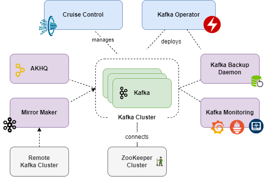
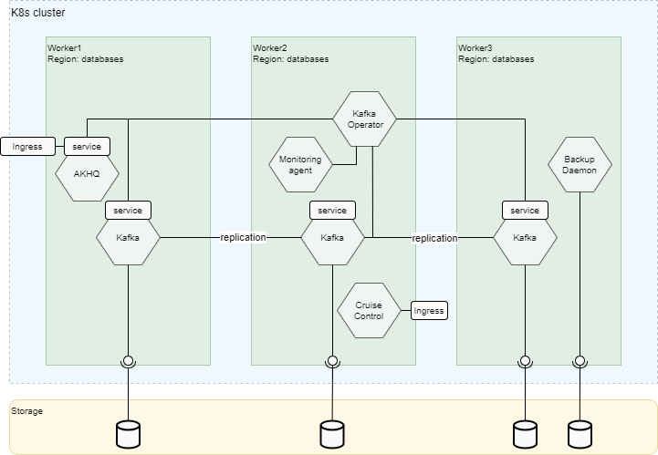
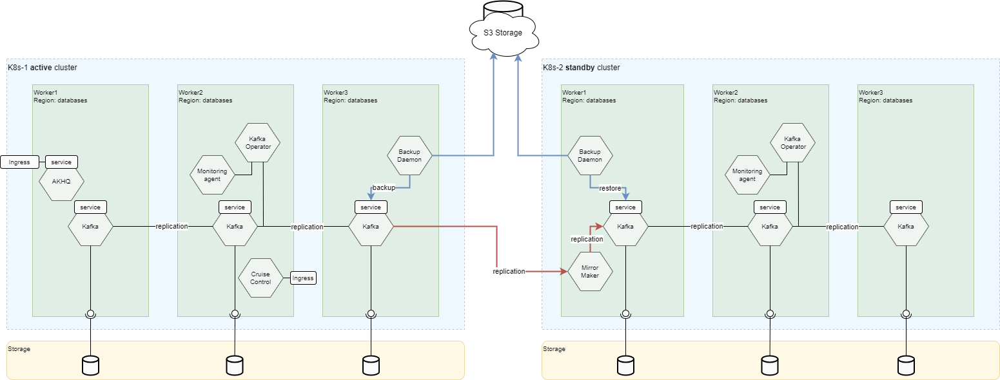

<!-- #GFCFilterMarkerStart# -->
[[_TOC_]]
<!-- #GFCFilterMarkerEnd# -->

# Overview

[Apache Kafka](https://kafka.apache.org/) is the most popular open-source stream-processing software for collecting, processing, storing,
and analyzing data at scale.
It is mostly popular for its excellent performance, low latency, fault tolerance, and high throughput.
It is capable of handling thousands of messages per second.
With over 1,000 Kafka use cases and counting, some common benefits are building data pipelines, leveraging real-time data streams,
enabling operational metrics, and data integration across countless sources.

Kafka event streaming applies to a wide variety of use cases across a plethora of industries and organizations.
The following are some examples:

* To process payments and financial transactions in real-time, such as in stock exchanges, banks, and insurances.
* To track and monitor cars, trucks, fleets, and shipments in real-time, such as in logistics and the automotive industry.
* To continuously capture and analyze sensor data from IoT devices or other equipment, such as in factories and wind parks.
* To collect and immediately react to customer interactions and orders, such as in retail, the hotel and travel industry, and mobile
  applications.
* To monitor patients in hospital care and predict changes in condition to ensure timely treatment in emergencies.
* To connect, store, and make available data produced by different divisions of a company.
* To serve as the foundation for data platforms, event-driven architectures, and microservices.

## Netcracker Kafka Delivery and Features

The Netcracker platform provides Kafka deployment to Kubernetes/OpenShift using their own helm chart with operator and additional features.
The deployment procedure and additional features include the following:

* Support of Netcracker deployment jobs for HA scheme and different configurations.
  For more information, refer to [Installation Guide](/docs/public/installation.md).
* Backup and restore for topics configuration.
  For more information, refer to [Kafka Backup Daemon Guide](https://git.netcracker.com/PROD.Platform.Streaming/kafka-backup-daemon/-/blob/master/documentation/maintenance-guide/development-guide/README.md).
* Monitoring integration with Grafana Dashboard and Prometheus Alerts.
  For more information, refer to [Monitoring Guide](/docs/public/monitoring.md).
* Mirroring data between Kafka clusters. For more information, refer to [Replication Guide](/docs/public/replication.md).
* User Interface (UI) provided by AKHQ.
* Monitoring, Management and self-healing Kafka cluster using Cruise Control.
* Disaster Recovery scheme with data replication or topics config replication.
  For more information, refer to [Disaster Recovery Guide](/docs/public/disaster-recovery.md).

# Kafka Components

The following image illustrates the Kafka components.

## Kafka Operator

The Kafka Operator is a microservice designed specifically for Kubernetes environments. 
It simplifies the deployment and management of Kafka clusters, which are critical for distributed coordination. 
In addition to deploying the Kafka cluster, the operator also takes care of managing supplementary services, ensuring seamless integration
and efficient resource utilization. 
With the Kafka Operator, administrators can easily maintain and scale their Kafka infrastructure, focusing on other important aspects of
their applications without worrying about the intricacies of cluster management.

In addition, Kafka operator performs disaster recovery logic and orchestrates Kafka switchover and failover operations. 

## Kafka

The Kafka is custom distribution of original Apache Kafka adapted for cloud environment, offering additional features and tools for enhanced
functionality and management. 
This container includes SASL authentication, providing secure access control to Kafka clusters. 
It also incorporates logging capabilities to capture and analyze important system events. 
Moreover, the container includes a Prometheus exporter, enabling seamless integration with monitoring systems for real-time metrics
collection. 
Additionally, it incorporates health check functionalities and other tools, streamlining the monitoring and maintenance of Kafka clusters. 
With this enhanced Docker container, users can effortlessly deploy and manage robust and secure Kafka environments with comprehensive
tooling support.

## Kafka Backup Daemon

The Kafka Backup Daemon is a microservice that offers a convenient REST API for performing backups and restores of Kafka topics and
ACL configurations. 
It enables users to initiate backups and restores programmatically, making it easier to automate these processes. 
Additionally, the daemon allows users to schedule regular backups, ensuring data protection and disaster recovery. 
Furthermore, it offers the capability to store topic backups on remote S3 storage, providing a secure and scalable solution for
long-term data retention.

## Kafka Monitoring

The Kafka Monitoring microservice is built on the Telegraf framework, specializing in collecting and analyzing metrics from Kafka. 
It seamlessly integrates with Kafka clusters, capturing essential data points for performance monitoring and analysis. 
Additionally, the microservice provides a Grafana dashboard, offering a comprehensive visualization of Kafka metrics for better insights
and diagnostics. 
It also includes an alerting system to promptly notify administrators of any potential issues or anomalies detected within the Kafka
environment. 
With Kafka Monitoring, users can effectively monitor the health and performance of their Kafka clusters, enabling proactive management and
maintenance.

## AKHQ

The [AKHQ](https://akhq.io/) is a user interface (UI) tool designed for Kafka, providing a user-friendly platform to manage Kafka topics and
perform read and write operations. 
With AKHQ, users can easily navigate and monitor Kafka topics, track consumer group offsets, and view detailed metrics and logs. 
It simplifies Kafka administration tasks, enabling efficient management of Kafka clusters through a comprehensive and intuitive interface.
It offers a wide range of authentication mechanisms, including LDAP and OpenID, ensuring secure access control for Kafka clusters.

## Mirror Maker

The [Kafka Mirror Maker](https://kafka.apache.org/documentation/#georeplication) is a powerful tool that facilitates asynchronous data
replication between Kafka clusters. 
It enables the seamless transfer of data from one cluster to another or from a remote cluster to a local one. 
With its flexible configuration options, users can specify the list of topics to be replicated, allowing for granular control over data
synchronization. 
Kafka Mirror Maker simplifies the process of maintaining data consistency and availability across multiple clusters, making it an essential
component for building robust and distributed Kafka architectures.

## Cruise Control

The [Kafka Cruise Control](https://github.com/linkedin/cruise-control) is a valuable service designed to monitor the health of
Kafka clusters and assist in resolving issues. 
It acts as a proactive guardian, continuously observing the state of the Kafka environment. In addition to health monitoring,
Cruise Control provides various automated operations such as cluster rebalancing, scaling in and out, and adding replicas. 
By leveraging these capabilities, administrators can optimize resource utilization, ensure workload distribution, and maintain overall
cluster stability. 
Kafka Cruise Control simplifies the management of Kafka clusters and helps maintain their performance and reliability.

# Supported Deployment Schemes

## On-Prem

### HA Deployment Scheme

The following image illustrates the deployment of Kafka in HA scheme.

Following the above picture, let us describe the main parts of the Kafka K8s deployment:

* The minimal number of replicas for HA scheme of Kafka is 3.
* Kafka pods are distributed through Kubernetes nodes and availability zones based on affinity policy during deployment.
* Each Kafka pod has its own Persistent Volume storage.
* In addition to Kafka main storage, the Kafka Backup Daemon pod has its own Persistent Volume for backups.
* Kafka Monitoring pod is deployed near the Kafka cluster and collects corresponding metrics.
* AKHQ pod is deployed with Ingress to access the UI.
* Cruise Control pod collects metrics from each Kafka pod and provides proposals that can be performed via the UI available under Ingress
  or REST API.
* Some components are deployed by the Kafka Operator. The Kafka Operator itself is deployed by Helm.

### Non-HA Deployment Scheme

For a non-HA deployment scheme, it is possible to use one pod of Kafka cluster and disable Cruise Control.

### DR Deployment Scheme

The Disaster Recovery scheme of Kafka deployment assumes that two independent Kafka clusters are deployed for both sides on separate
Kubernetes environments with some kind of replication between them.

In the common case Kafka provides two schemes for disaster recovery:

1. Replication of topics data and consumer offsets between Kafka clusters via Mirror Maker (red arrows).
2. Replication of topics configurations via backup and restore operations during switchover and failover (blue arrows).

For more information about these schemes, refer to [Kafka Disaster Recovery Guide](/docs/public/disaster-recovery.md).

## Integration With Managed Services

### Google Cloud

Not Applicable: default HA scheme is used for deployment to Google Cloud.

### AWS Kafka MSK

The Kafka Service allows you to deploy Kafka supplementary services (AKHQ, Monitoring, Mirror Maker, Cruise Control, Backup Daemon) without
deploying Kafka, using Amazon Managed Streaming for Apache Kafka (MSK) connection. 
Thus, the features and functions of these services are adopted to Amazon MSK and available as for Netcracker Kafka delivery. 

For more information, refer to [Amazon MSK](/docs/public/managed/amazon.md).

### Azure

Not Applicable: default HA scheme is used for deployment to Azure.

### Aiven Managed Kafka

The same scheme is used as for [AWS Kafka MSK](#aws-kafka-msk).

For more information, refer to [Aiven Managed Kafka](/docs/public/managed/aiven.md).
